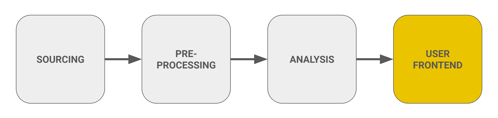

# Step 3: Building the User Frontends

## Overview
In this section, we will describe how we built the different user frontends. We have built an end-to-end solution through our Streamlit app, which features three main dashboards. The Visitor Dashboard enables users to plan their trips effectively, providing tools to enhance their experience at the park. The Administration Dashboard assists park management in making strategic decisions regarding resource allocation, optimizing operational efficiency. Additionally, a dedicated Data Accessibility Point is included, which is exclusively accessible to park administration, allowing them to manage and query important data seamlessly.

---

## Visitor Dashboard

The Visitor Dashboard serves as a comprehensive tool for visitors to the Bavarian Forest National Park, offering real-time data and insights to enhance their experience.

1. **Real-Time Weather Data**:
    - We have integrated real-time weather data from Metostat for the upcoming week, ensuring visitors have accurate information about current conditions.

2. **Parking Data**:
    - Parking availability is monitored using data fetched from Bayern Cloud for 12 parking sensors. Currently, 10 sensors are operational, as 2 are offline.
    - Visualization of parking occupancy is provided by fetching the coordinates of these sensors, indicating high, medium, and low thresholds for parking availability.

3. **Visitor Traffic Forecast**:
    - Forecasted visitor traffic is displayed for various regions of the park on an hourly basis for the coming week.
    - Users can select specific dates and regions to view 'IN' and 'OUT' values for each region, overall traffic across the park, and total incoming and outgoing visitor flows.

4. **Recreational Activities**:

    The dashboard highlights various recreational activities available in the park, including:

    - **Hiking**: 🥾 Explore trails through the scenic wilderness. [Learn More](https://www.nationalpark-bayerischer-wald.bayern.de/english/visitor/hiking/index.htm)
    - **Cycling**: 🚴‍♂️ Cycle through picturesque routes. [Learn More](https://www.nationalpark-bayerischer-wald.bayern.de/english/visitor/bicycling/index.htm)
    - **Camping**: 🏕️ Relax under the stars at designated camping spots. [Learn More](https://www.nationalpark-bayerischer-wald.bayern.de/english/visitor/facilities/camping/index.htm)
    - **Snowshoeing**: 🌨️ Enjoy snowshoeing during the winter months. [Learn More](https://www.nationalpark-bayerischer-wald.bayern.de/english/visitor/snowshoeing/index.htm)
    - **Skiing**: 🎿 Ski on the best cross-country trails. [Learn More](https://www.nationalpark-bayerischer-wald.bayern.de/english/visitor/cross_country_skiing/index.htm)

5. **Language Selection**:
    - The dashboard supports both German and English languages, making it accessible to a broader audience.

6. **Additional Information**:

    - A section for **Other Information** provides valuable insights to visitors:
        - **Visitor Centers**: 🏛️ Information about the main visitor centers in the Bavarian Forest. [Learn More](https://www.nationalpark-bayerischer-wald.bayern.de/english/visitor/facilities/index.htm)
        - **Popular Entrances to the Park**:
            - **Entrance 1: Falkenstein**: Access to hiking trails and the Falkenstein mountain. [Learn More](https://www.nationalpark-bayerischer-wald.bayern.de/english/visitor/facilities/npc_falkenstein/index.htm)
            - **Entrance 2: Lusen**: Gateway to challenging trails on the Lusen mountain. [Learn More](https://www.nationalpark-bayerischer-wald.bayern.de/english/visitor/facilities/npc_lusen/index.htm)
        - **Best Way to Get There**: 🚌 Information on transportation options to reach the Bavarian Forest. [Learn More](https://www.nationalpark-bayerischer-wald.bayern.de/english/service/getting_there/index.htm)

---

## Administration Dashboard

The Administration Dashboard is designed to assist park management in making strategic decisions based on comprehensive data and analytics. It provides essential insights into visitor counts and parking occupancy to optimize operational efficiency.

1. **Forecasted Hourly Predictions**:
    - The dashboard presents the distribution of forecasted visitor traffic across the park for the next seven days, allowing administrators to anticipate visitor flows and plan resources accordingly.

2. **Absolute Visitor Counts**:
    - Unlike the Visitor Dashboard, the Administration Dashboard provides absolute numbers for visitor counts, enabling precise tracking of park attendance. Visualizations of these counts help in understanding trends and patterns over time.

3. **Real-Time Parking Occupancy**:
    - Real-time data for parking occupancy is displayed for 10 out of 12 parking sensors. For each selected location, the dashboard shows:
        - **Available Spaces**: The current number of available parking spaces.
        - **Capacity**: The total capacity of the selected parking area.
        - **Occupancy Rate**: The percentage of the parking area currently occupied.

---

## Data Accessibility Point

The Data Accessibility Point provides park administration with a seamless interface for managing and querying important data. It includes features for both uploading and downloading data, ensuring efficient data handling.

### Data Upload Section
- Administrators can upload data related to:

    - **Visitor Count Sensors**
    - **Visitor Count Centers**
    - **Other Data Types**

- Before uploading, users can preview the entire dataset and generate a data summary report using Pandas Profiling. This allows for a quick assessment of the data quality and structure.
- Once reviewed, the uploaded data is stored securely in the system for future access and analysis.

### Data Download Section
- Users can select specific data categories to download, including:
    - **Visitor Count Sensors**
    - **Visitor Count Centers**
    - **Other Categories**
- A preview of the selected data will be available, ensuring that users can verify the information before downloading.

### Data Query Section

The query section of the Streamlit application is designed to enable users to access and analyze data related to three main categories: **Weather**, **Visitor Occupancy**, and **Parking**. Users can apply various filters such as date ranges, months, and seasons to customize their queries. Based on these selected criteria, the application generates specific queries to retrieve data points from the underlying dataset. This feature allows users to efficiently extract relevant insights.

**Main Categories of Data**

1. **Weather Data**: Includes properties like temperature, precipitation, wind speed, relative humidity, and sunshine duration. Users can retrieve meteorological information for specific time periods or analyze patterns across months and seasons.

2. **Visitor Occupancy**: Provides data from various visitor sensors, which include metrics such as the number of visitors entering ("IN"), exiting ("OUT"), or the total number of visitors ("TOTAL") at specific locations. This data helps to monitor and predict visitor flow within the park.

3. **Parking**: Captures data from parking sensors, such as occupancy levels, parking capacity, and occupancy rates. This information is useful for managing and analyzing parking facilities' utilization.

**Filters for Query Refinement**

To refine their queries, users can apply various filters:

- **Date Selection**: Allows users to specify a start and end date, limiting the query to a particular timeframe. By default, the date range is set to retrieve data from the past 7 days.

- **Months**: Enables users to select one or more months from January to December, filtering data based on monthly patterns.

- **Seasons**: Provides another way to filter data, allowing users to retrieve information for specific seasons: Winter, Spring, Summer, or Fall.

- **Year Filter**: Automatically applied based on the selected months or seasons. If no months or seasons are selected, users are prompted to choose at least one to proceed with the query.

Each category also has its own set of specific filters. For example:
- In the **Weather** category, users can select properties like temperature or precipitation.
- In the **Parking** category, users can choose specific parking sensors and related data, such as occupancy rates.
- In **Visitor Occupancy**, users can select which visitor sensors to focus on and what metrics to retrieve (e.g., IN, OUT, or TOTAL visitors).

**Types of Queries**

Queries are categorized into three types:

1. **Date Range Queries**: Allow users to retrieve data within a specific timeframe. For instance, users might ask, “What was the temperature between September 1, 2024, and September 7, 2024?” This type of query is available across all three categories (Weather, Visitor Occupancy, Parking), helping users analyze short-term trends.

2. **Monthly Queries**: Provide aggregated data for a specific month. For example, a user might query, “What was the total visitor count in August 2024?” Monthly queries help users examine patterns over the course of a particular month.

3. **Seasonal Queries**: Offer insight into broader seasonal trends. For example, users can ask, “What was the parking occupancy rate during the Summer of 2024?” These queries allow users to compare data across different seasons, which is useful for seasonal forecasting and planning.

**Query Generation Process**

The query generation process is managed by the `generate_queries` function, which dynamically constructs query strings based on the user’s inputs. The function captures all selected filters—whether they pertain to date, month, season, or a specific category—and formats them into a query structure. These queries are then outputted in a structured format that the application can execute, allowing users to easily access the data they need.

Additionally, the system incorporates error handling mechanisms. For instance, if the selected end date is earlier than the start date, users will receive an error message prompting them to correct the date range. Furthermore, if a query returns no data, an informative message is displayed, guiding the user to adjust their filters.