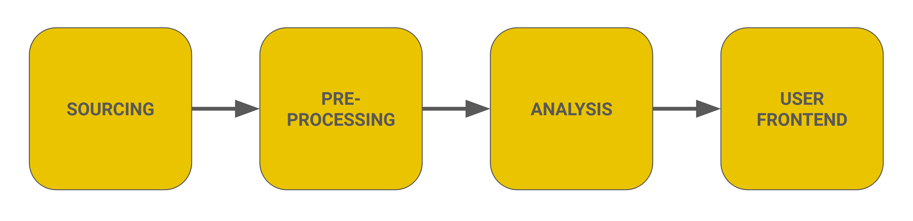

# Our Approach in a Nutshell

---

We developed an **end-to-end solution** from data sourcing via data pre-processing and analysis to several user frontends.

- In section **Step 1: Data Sourcing** we will describe the data sources which we used as well as the methods to source them.

- In section **Step 2: Building the Prediction Pipeline** we will describe our data preprocessing and data cleaning steps, the data integration, feature selection and feature engineering, as well as our modeling approach and the selected models.

- In section **Step 3: Building the User Frontends** we will describe how we built the different user frontends, that is two dashboards and a data access point, in the application Streamlit.

