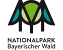

# Welcome! 

# PROJECT DOCUMENTATION.

# **HARMONIZING TOURISM  AND NATURE PROTECTION.**   Data-driven visitor management in the   Bavarian Forest National Park.

  
 
 

The project was carried out as part of the  **Data Science for Social Good (DSSGx) Munich 2024** fellowship   in collaboration with the Bavarian Forest National Park.

---

**In this documentation, you will find information on**  
- project background, mission, solution, and impact  
- data sources used and data sourcing methods  
- the user frontends (dashboards and data access point)  
- the underlying prediction pipeline (pre-processing, integration, feature selection and engineering, modeling)  
- our findings and results incl. discussion  
- the API reference

---

**Enjoy exploring!**  
*Anthony, Ayesha, Manpa, and Patricio*